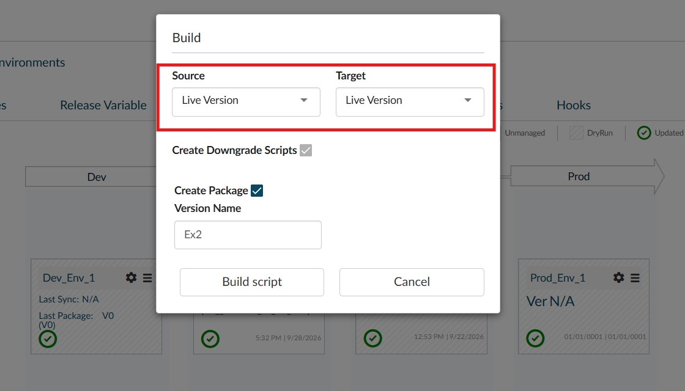
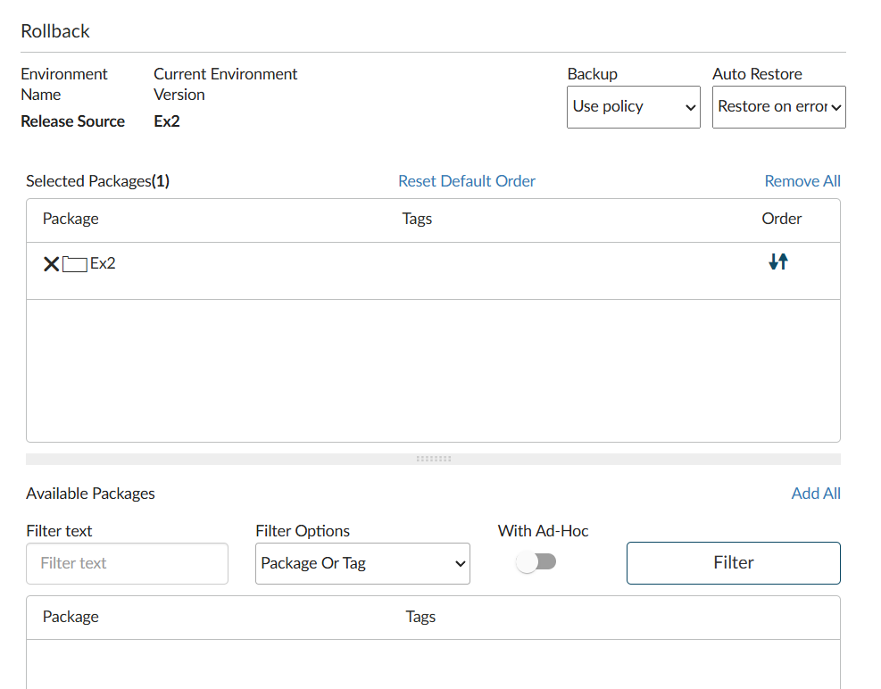

# Workshop DBmaestro + Oracle: ejercicios prácticos

Ejercicios para practicar DBmaestro DevOps Platform (DOP) con Oracle: paquetes manuales, build desde DEV, pre-check, deploy por pipeline, rollback y detección de drift.

Los scripts SQL de cada ejercicio están en [`scripts/`](scripts/).

## Entorno de cada participante

- Proyecto `WORKSHOPn` (n = número asignado a cada participante), tipo **Deploy by tasks**.
- Esquemas del pipeline: `WSn_DEV` → `WSn_DR` (DryRun) → `WSn_RS` (Release Source) → `WSn_QA` → `WSn_PROD`.
- El paquete `V0` ya está desplegado en Dev, Release Source y QA.
- Los datos de conexión (host, servicio y credenciales) los entrega el instructor.

> Donde dice `WSn_`, reemplazar `n` por el número propio (ej. `WS3_DEV`).
> Los nombres de menú (Create Package, Build, Pre-check) pueden variar un poco según la versión de DOP.

---

## Ejercicio 0: Reconocimiento (10 min)

1. Entrar a DOP y abrir el proyecto `WORKSHOPn`.
2. Revisar la pestaña **Environments** y su orden en el pipeline.
3. Ejecutar **Test Connection** en cada entorno.
4. En **Package Manager**, ver el paquete `V0` y en qué entornos está desplegado.

✅ **Resultado esperado:** los 5 entornos conectan bien y `V0` figura en Dev, RS y QA.

---

## Ejercicio 1: Paquete manual subiendo scripts por la UI (crear una tabla)

**Objetivo:** armar un paquete a mano con scripts de upgrade y downgrade.

Scripts: [`scripts/ex01/`](scripts/ex01/)

| Archivo | Tipo |
|---|---|
| `01_create_customers.sql` | Upgrade |
| `01_drop_customers.sql` | Downgrade |

1. Descargar los dos archivos.
2. En **Package Manager**, hacer clic en **Create Package**, con nombre `EX01`.
3. Subir `01_create_customers.sql` como **Upgrade** y `01_drop_customers.sql` como **Downgrade**.
4. Revisar el orden de los scripts y guardar.

✅ **Resultado esperado:** `EX01` aparece en estado *Pending* (sin desplegar) con 1 script de upgrade y 1 de downgrade.

> ℹ️ **Nota:** `EX01` es solo para practicar cómo se arma un paquete a mano: **no se despliega** en ningún ejercicio. La tabla `EX_CUSTOMERS` llega a Release Source y QA dentro de `EX02` (ejercicio 2), que se genera con Build desde DEV.

💡 **Para pensar:** ¿qué pasa si el paquete no tiene downgrade? (Se retoma en el ejercicio 5.)

---

## Ejercicio 2: Paquete desde DEV (crear un stored procedure)

**Objetivo:** desarrollar en DEV y dejar que DBmaestro arme el paquete a partir de los cambios.

Scripts: [`scripts/ex02/`](scripts/ex02/)

1. Conectarse a `WSn_DEV` con SQL Developer / SQLcl.
2. Si `EX_CUSTOMERS` todavía no existe en DEV, ejecutar `dev_create_customers.sql`.
3. Ejecutar `dev_create_proc_add_customer.sql`.
4. En DOP, en la vista de entornos del proyecto, abrir el menú de **Dev** y elegir **Build**.
5. En el diálogo **Build**, completar:
   - **Source:** `Live Version`
   - **Target:** `Live Version`
   - **Create Downgrade Scripts:** marcado
   - **Create Package:** marcado
   - **Version Name:** `EX02`

   

   Hacer clic en **Build script**. El Build no deja elegir objetos sueltos: DBmaestro compara los esquemas e incluye en el paquete todas las diferencias que encuentra.
6. Abrir el paquete generado y revisar el script que armó DBmaestro. Si no trae downgrade, agregar `02_drop_proc_add_customer.sql`.

✅ **Resultado esperado:** `EX02` contiene el `CREATE OR REPLACE PROCEDURE` generado a partir de DEV.

💡 **Para pensar:** comparar con el ejercicio 1. ¿Quién escribió el script en cada caso? ¿Cuál tiene menos riesgo de que el script no coincida con lo que hay en DEV?

---

## Ejercicio 3: Precheck del paquete

**Objetivo:** validar el paquete contra las políticas antes de desplegarlo.

1. Seleccionar `EX01` y ejecutar **Pre-check**.
2. Revisar el resultado: reglas evaluadas, warnings y errores.
3. Hacer lo mismo con `EX02`.

✅ **Resultado esperado:** `EX01` y `EX02` pasan el Pre-check.

💡 **Para pensar:** ¿qué reglas de política están activas en el proyecto? ¿Cuáles bloquean y cuáles solo avisan?

---

## Ejercicio 4: Deploy por el pipeline (Release Source → QA)

Scripts: [`scripts/ex04/`](scripts/ex04/)

1. Hacer **Upgrade** de `WSn_RS` con el paquete `EX02`.
2. Revisar el log de ejecución.
3. Promover `EX02` a **QA**.
4. Ejecutar `verify_qa.sql` en `WSn_QA`.

✅ **Resultado esperado:** `EX02` figura como desplegado en RS y QA, y en QA el procedure inserta la fila.

---

## Ejercicio 5: Rollback

Scripts: [`scripts/ex05/`](scripts/ex05/)

1. Abrir el menú del entorno **QA**, elegir **Rollback** y seleccionar el package que se desea rollbackear: `EX02`. Tiene que quedar en **Selected Packages**. Dejar **Backup** y **Auto Restore** con sus valores por defecto y confirmar.

   

   *La captura muestra el diálogo abierto sobre Release Source; en QA se ve igual.*
2. Ejecutar `verify_rollback.sql` en `WSn_QA` y confirmar que `EX_ADD_CUSTOMER` ya no existe.
3. Volver a hacer **Upgrade** de QA a la última versión.

💡 **Para pensar:** ¿qué pasaría con el rollback si `EX02` no tuviera un script de downgrade?

---

## Ejercicio 6: Detección de drift

Scripts: [`scripts/ex06/`](scripts/ex06/)

1. Conectarse directamente a `WSn_QA`, por fuera de DBmaestro, y ejecutar `qa_manual_drift.sql`.
2. En DOP, ejecutar **Validate** sobre QA.
3. Intentar desplegar un paquete nuevo en QA y ver qué pasa.

✅ **Resultado esperado:** DBmaestro detecta la diferencia (drift) entre el estado esperado y el real, y avisa o bloquea el deploy.

💡 **Para pensar:** ¿cómo se corrige? Una opción es revertir el cambio manual (`qa_revert_drift.sql`); la otra es formalizarlo en un paquete que venga desde DEV.

---

## Ejercicio 7: Modificar un paquete existente (desafío)

Scripts: [`scripts/ex07/`](scripts/ex07/)

1. Ejecutar `dev_create_index_email.sql` en `WSn_DEV`.
2. Generar el paquete `EX04` desde DEV.
3. Antes de desplegar, agregar a mano en la UI `02_insert_demo_customer.sql` (Upgrade) y `02_delete_demo_customer.sql` (Downgrade).
4. Ejecutar Pre-check y hacer Upgrade de RS y QA.

---

## Ejercicio 8: Labels y trazabilidad (desafío)

1. Aplicar el label `WORKSHOP_DONE` sobre Release Source.
2. Revisar **Activities / Audit** y reconstruir quién desplegó qué, dónde y cuándo.
3. *(Opcional, DOP 26.3 o posterior)* Usar **Explain Package / Audit Package** (Genie AI) sobre `EX02`.

---

## Resumen

| # | Tema | Paquete | Tiempo |
|---|------|---------|--------|
| 0 | Reconocimiento | V0 | 10' |
| 1 | Paquete manual (tabla) | EX01 | 15' |
| 2 | Build desde DEV (SP) | EX02 | 20' |
| 3 | Pre-check | EX01, EX02 | 15' |
| 4 | Deploy RS → QA | EX02 | 15' |
| 5 | Rollback | EX02 | 10' |
| 6 | Drift | n/a | 15' |
| 7 | Desafío: modificar paquete | EX04 | 20' |
| 8 | Desafío: labels / auditoría | n/a | 10' |

## Estructura del repositorio

```
scripts/
  ex01/  Paquete manual: tabla EX_CUSTOMERS (upgrade + downgrade)
  ex02/  Scripts para ejecutar en DEV: tabla + procedure EX_ADD_CUSTOMER
  ex04/  Verificación del deploy en QA
  ex05/  Verificación del rollback
  ex06/  Generar y revertir drift en QA
  ex07/  Índice desde DEV + script de datos manual
images/  Capturas de pantalla de la UI
```
